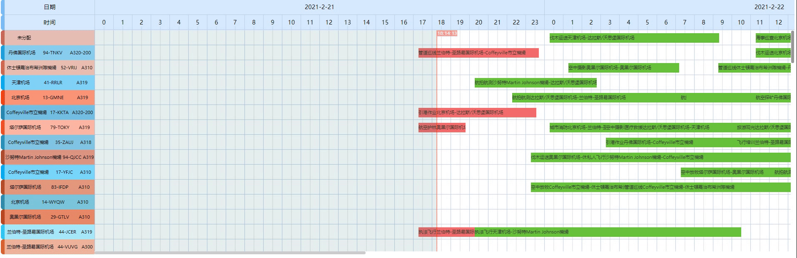

# Gantt Chart  -Javascript - Vue

## 一个特殊的业务轮子

### Demo
[预览](https://xihaoshangdi.github.io/vue-gantt-chart/)

### Feature
- 宽高可变自适应
- 拖拽功能
- 右击自定义事件
- 首行粘性

### Screenshot


### Install
#### npm
```shell script
npm i vue-gantt-chart --save
```
#### yarn
```shell script
yarn add vue-gantt-chart
```
Include plugin in your `main.js` file.

```javascript
import GanttChart from 'vue-gantt-chart'
import 'vue-gantt-chart/lib/vue-gantt-chart.css';
Vue.use(GanttChart)
```
### Use
#### Template
```vue
<template>
    <GanttChart
        :gantt-data="GanttData"
        :gantt-current-time="GanttCurrentTime"
        :first-line-stick="firstLineStick"
        :time-section="GanttTime"
        :chart-max-height="ChartHeight"
        :float-view-render-fn="floatRender"
        @rightClick.native="handleRightClick"
    >
        <template #side-box="{item}">
          <!--侧边栏组件-->
          <SideComponent :side-info="item" />
        </template>
        <template #container-box="{item}">
          <!--内容栏组件-->
          <ContentComponent :content-info="item" />
        </template>
    </GanttChart>
</template>
```
### API
#### Attributes
| param      | required | type  | default | describe |
|------------|----------|-------|---------|----------|
| timeSection | √        | `Array` |  | 甘特图的时间区间  `['2021/02/21', '2021/02/24']`|
| gantt-data | √        | `Array` |   | 甘特图的数据来源 `[]`|
| gantt-current-time     | X   |      `Number` | `new Date().getTime()`    |  甘特图时间轴渲染的当前时间        |
| first-line-stick | X       | `Boolean` |   `true`   | 首行是否粘性|
| chartMaxHeight | X        | `Number` |    `500`  | 甘特图内容最大高度|
| show-header | X        | `Boolean` |   `true`    | 是否渲染表头|
| header-data | X        | `Array` |   `['日期', '时间']`    | 表头标题|
| floatViewRenderFn | X        | `Function` |   `() => { return (info) => info }`    | Tip渲染函数 |
##### gantt-data
`gantt-data`需要满足特殊的数据格式才能被正常的渲染，外层对象渲染为甘特条需要`childArray`属性用于承载甘特块,内层对象渲染为甘特块,需要`start`、`end`用于计算偏移的像素
```js
[
  {
    //整行的甘特块具有的属性
    "childArray":[// 渲染在甘特块上的甘特条
                    {
                      // 甘特条具有的属性
                      "start":"2021/02/26 07:08",// 甘特条渲染的起始时间
                      "end":"2021/02/26 08:44"// 甘特条渲染的结束时间
                    }
                  ]
  }
]
```
##### floatViewRenderFn
`floatViewRenderFn`作为渲染函数用于渲染甘特块的部分数据到甘特块的Tip上.
```js
(info) => `<div>${info.start}</div><div>${info.end}</div>`
```
#### Event
| param      | describe                                                                       |
|------------|----------|
|rightClick|甘特块右击会触发事件，抛出自定义事件对象，甘特块的数据被包含在`event.detail`中|
#### Scoped Slot
```vue
<template #side-box="{item}">
  <SideComponent :side-info="item" />
</template>
<template #container-box="{item}">
  <ContentComponent :content-info="item" />
</template>
```

| name      | describe                                                                       |
|------------|----------|
|#side-box|具名插槽，传递自定义数据项的内容，参数为 { item }|
|#container-box|具名插槽，传递自定义数据项的内容，参数为 { item }|

### 反馈缺陷 Bug
```javascript
- **Version**: 
- **Mini Showcase Repository**:
- **Error Message**:
```

### 提交新需求 Feature Request
#### 背景
- 描述你希望解决的问题的现状
- 你希望获得的功能的设计和实现

### 开源协议
MIT
